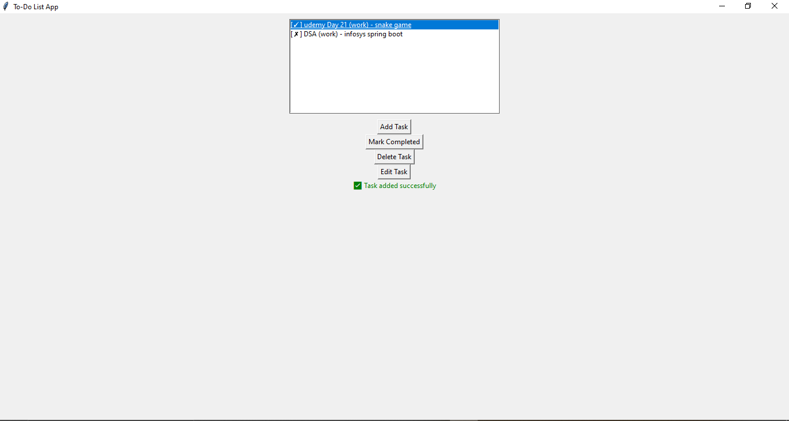

# 📝 Personal To-Do List Application

## 📌 Objective
This project is a simple **Personal To-Do List Application** developed in Python. It allows users to manage tasks efficiently — add, edit, categorize, mark as complete, and delete tasks. Data is saved using JSON for persistence between sessions.

---

## 💡 Features

- ✅ Add new tasks with a title, description, and category (e.g., Work, Personal)
- ✏️ Edit existing tasks
- 📋 View all tasks with completion status
- 🟩 Mark tasks as completed
- 🗑️ Delete tasks
- 💾 Persistent storage using a local `tasks.json` file
- 🖼️ Graphical User Interface using Tkinter

---

## 🛠️ Technologies Used

- **Python 3.x**
- **Tkinter** (for GUI)
- **JSON** (for file-based storage)

---
## 🗂️ Project Folder Structure
todo_app/
├── todo_gui.py         # GUI version using Tkinter
├── todo.py             # Command-line version (optional)
├── tasks.json          # JSON file storing all tasks
├── README.md           # Project documentation
└── todo.png            # GUI screenshot
    

## ▶️ How to Run

cd path/to/todo_app
python todo_gui.py

## 📸 Screenshot

### 🖼️ Main GUI Window

Author
Navya A. – Python Developer Intern
July 2025

## 📜 License

This project is for **educational use only**.  
It was developed as part of an internship project and is **not intended for commercial distribution**.  
You may view, run, and learn from the code, but do not redistribute or use it in production systems.

